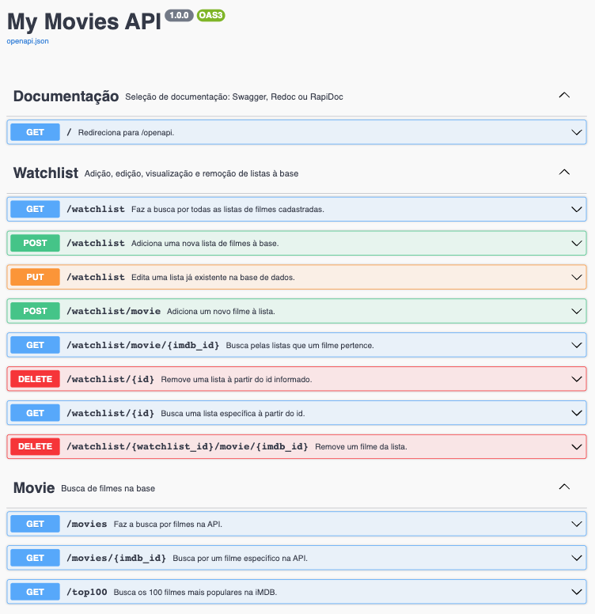

# My Movies API

Este pequeno projeto faz parte do projeto final da Disciplina **Desenvolvimento Full Stack Avançado**

O objetivo aqui é apresetar uma API emplementada seguindo o estilo REST.

<p align="center">
  
</p>

### Technologias

- [Flask](https://flask.palletsprojects.com/en/2.3.x/)
- [SQLAlchemy](https://www.sqlalchemy.org/)
- [OpenAPI3](https://swagger.io/specification/)
- [SQLite](https://www.sqlite.org/index.html)

---

### Instalação

Será necessário ter todas as libs python listadas no `requirements.txt` instaladas.
Após clonar o repositório, é necessário ir ao diretório raiz, pelo terminal, para poder executar os comandos descritos abaixo.

> É fortemente indicado o uso de ambientes virtuais do tipo [virtualenv](https://virtualenv.pypa.io/en/latest/installation.html).

```
(env)$ pip install -r requirements.txt
```

Este comando instala as dependências/bibliotecas, descritas no arquivo `requirements.txt`.

---

### Executando o servidor

Para executar a API basta executar:

```
(env)$ flask run --host 0.0.0.0 --port 5000
```

Em modo de desenvolvimento é recomendado executar utilizando o parâmetro reload, que reiniciará o servidor
automaticamente após uma mudança no código fonte.

```
(env)$ flask run --host 0.0.0.0 --port 5000 --reload
```

---

### Acesso no browser

Abra o [http://localhost:5000/#/](http://localhost:5000/#/) no navegador para verificar o status da API em execução.

---

## Como executar através do Docker

Certifique-se de ter o [Docker](https://docs.docker.com/engine/install/) instalado e em execução em sua máquina.

Navegue até o diretório que contém o Dockerfile e o requirements.txt no terminal.
Execute **como administrador** o seguinte comando para construir a imagem Docker:

```
$ docker build -t rest-api .
```

Uma vez criada a imagem, para executar o container basta executar, **como administrador**, seguinte o comando:

```
$ docker run -p 5000:5000 rest-api
```

Uma vez executando, para acessar a API, basta abrir o [http://localhost:5000/#/](http://localhost:5000/#/) no navegador.
