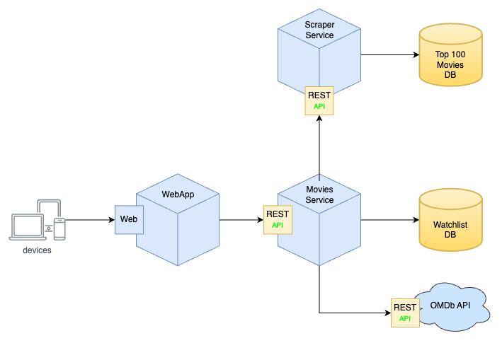

# My Movies API

Este projeto de API foi desenvolvido em Flask para a disciplina de **Desenvolvimento Backend Avançado** do programa de pós-graduação em Desenvolvimento Full Stack da [PUC-Rio](https://www.puc-rio.br/index.html).

O objetivo deste projeto é criar uma API para gerenciar uma lista de filmes, com as seguintes funcionalidades:

- [x] Listar os filmes mais populares na IMDb
- [x] Buscar filmes por nome
- [x] Criar, editar e remover listas de filmes
- [x] Adicionar ou remover filmes de uma lista

Esta API foi feita baseada em microserviços usando uma arquitetura REST,
de acordo com o diagrama abaixo:

<p align="center">
  
</p>

---

## Documentação

<p align="center">
  
</p>

### Technologias

- [Flask](https://flask.palletsprojects.com/en/2.3.x/)
- [SQLAlchemy](https://www.sqlalchemy.org/)
- [OpenAPI3](https://swagger.io/specification/)
- [SQLite](https://www.sqlite.org/index.html)
- [Docker](https://www.docker.com/)
- [Docker Compose](https://docs.docker.com/compose/)
- [OMDb API](http://www.omdbapi.com/)

---

### Instalação

Será necessário ter todas as libs python listadas no `requirements.txt` instaladas.
Após clonar o repositório, é necessário ir ao diretório raiz, pelo terminal, para poder executar os comandos descritos abaixo.

> É fortemente indicado o uso de ambientes virtuais do tipo [virtualenv](https://virtualenv.pypa.io/en/latest/installation.html).

```
(env)$ pip install -r requirements.txt
```

Este comando instala as dependências/bibliotecas, descritas no arquivo `requirements.txt`.

---

### Executando o servidor

Para executar a API basta executar:

```
(env)$ flask run --host 0.0.0.0 --port 5000
```

Em modo de desenvolvimento é recomendado executar utilizando o parâmetro reload, que reiniciará o servidor
automaticamente após uma mudança no código fonte.

```
(env)$ flask run --host 0.0.0.0 --port 5000 --reload
```

---

#### Acesso no browser

Abra o [http://localhost:5000/#/](http://localhost:5000/#/) no navegador para verificar o status da API em execução.

---

### Como executar através do Docker

Certifique-se de ter o [Docker](https://docs.docker.com/engine/install/) instalado e em execução em sua máquina.

Navegue até o diretório que contém o Dockerfile e o requirements.txt no terminal.
Execute **como administrador** o seguinte comando para construir a imagem Docker:

```bash
$ docker-compose up
```

Acesse o [http://localhost:5000/](http://localhost:5000/) para acessar a aplicação.

## Executando o microserviço de Web Scrapping dos 100 filmes mais populares da IMDb

Para rodar o microserviço, acesse o repositório do [microserviço](https://github.com/eliasmatheus/imdb-top100-microservice.git) e siga as instruções.

## Executando o frontend

Para rodar o frontend, acesse o repositório do [frontend](https://github.com/eliasmatheus/my-movies-frontend.git) e siga as instruções.
